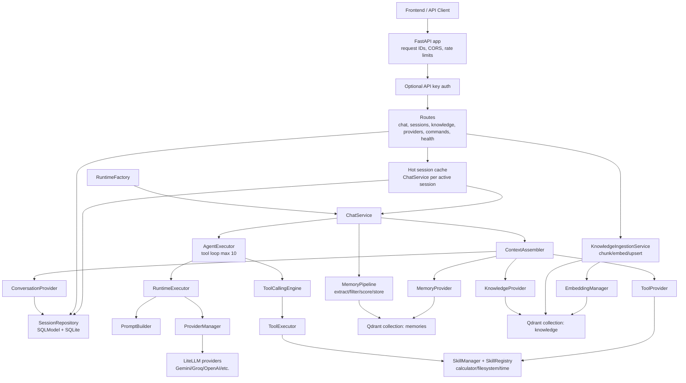

# Doitall Frontend Planning Report

## 1. Repository overview

Doitall is a Python 3.14, FastAPI-based AI agent platform. It combines chat sessions, multi-provider LLM access through LiteLLM, a tool/skill execution loop, semantic memory, RAG knowledge ingestion, SQLite-backed session persistence, Qdrant-backed vector stores, and a small REST API suitable for a future web frontend.

### Core stack

- **Backend framework:** FastAPI with Pydantic v2 request/response models.
- **CLI/runtime:** Typer entrypoint (`doitall`) and Uvicorn API serving.
- **LLM abstraction:** LiteLLM client with provider adapters for Gemini, Groq, OpenAI, Anthropic, Ollama, and OpenRouter.
- **Persistence:** SQLModel/SQLAlchemy for sessions/messages; Alembic migration scaffold.
- **Vector storage:** Qdrant collections for `memories` and `knowledge`.
- **Embeddings:** LiteLLM-backed embedding service selected by `EMBEDDING_MODEL`.
- **Testing/linting:** Pytest, pytest-asyncio, Ruff, mypy config.

### High-level behavior

1. API receives a chat request.
2. A session-scoped `ChatService` is created or reused from the hot cache.
3. `ContextAssembler` gathers conversation history, relevant memories, relevant knowledge chunks, and available tools.
4. `PromptBuilder` composes system, memory, knowledge, and conversation messages.
5. `RuntimeExecutor` calls the selected LLM provider.
6. `AgentExecutor` runs a bounded tool-calling loop if tool calls are returned.
7. Conversation messages and tool results are persisted.
8. `MemoryPipeline` extracts, filters, scores, and stores memories best-effort.
9. API returns either a normal JSON response or SSE events.

## 2. Architecture diagram



## 3. API documentation

Base URL defaults to `http://127.0.0.1:8000` with all main API routes mounted under `/v1`.

### Authentication

Authentication is optional. If `API_KEY` is unset, protected endpoints allow requests. If `API_KEY` is set, protected endpoints require either:

- `Authorization: Bearer <API_KEY>`
- `X-API-Key: <API_KEY>`

Protected endpoints: chat, streaming chat, sessions, commands, and knowledge ingestion. Provider listing and health endpoints are public. Metrics can be protected independently with `METRICS_REQUIRE_API_KEY`.

### `POST /v1/chat`

Send one user message and receive a complete assistant response.

**Request**

```json
{
  "message": "What is 12 * 9?",
  "provider": "gemini",
  "session_id": "optional-existing-session-id"
}
```

**Response**

```json
{
  "response": "108",
  "model": null,
  "session_id": "generated-or-existing-session-id"
}
```

**Notes**

- `message` is required, min length 1, max `CHAT_MESSAGE_MAX_LENGTH`.
- `provider` is optional and overrides `DEFAULT_PROVIDER` for the turn.
- `session_id` is optional; a UUID is generated if omitted.
- Unknown providers return `422`.
- Generic runtime failure returns `500` with a stable chat failure message.

### `POST /v1/chat/stream`

Stream a chat response as Server-Sent Events.

**Request**: same body as `/v1/chat`.

**Response media type**: `text/event-stream`

**Event format**

Each event includes `id`, `event`, `data`, and a timestamp inside the JSON payload.

Expected event sequence:

1. `session` with `{ "session_id": "..." }`
2. `thinking` lifecycle events
3. zero or more `token` events with `{ "text": "..." }`
4. `done` with `{ "message": "[DONE]" }`
5. `error` if the stream fails

**Frontend implication**: the UI should parse SSE by `event:` type, concatenate `token.data.text`, and treat `done` as stream completion.

### `GET /v1/sessions`

List persisted sessions ordered by recency.

**Response**

```json
[
  {
    "session_id": "abc",
    "agent_name": "Doitall",
    "created_at": "2026-08-01T00:00:00+00:00",
    "last_accessed_at": "2026-08-01T00:01:00+00:00",
    "message_count": 4
  }
]
```

### `GET /v1/sessions/{session_id}`

Return full session metadata and complete message history.

**Response**

```json
{
  "session_id": "abc",
  "agent_name": "Doitall",
  "created_at": "2026-08-01T00:00:00+00:00",
  "last_accessed_at": "2026-08-01T00:01:00+00:00",
  "message_count": 2,
  "messages": [
    {
      "role": "user",
      "content": "Hello",
      "tool_calls": [],
      "created_at": "2026-08-01T00:00:01+00:00"
    }
  ]
}
```

### `DELETE /v1/sessions/{session_id}`

Delete a session and its messages. Returns `204` on success or `404` if missing.

### `POST /v1/knowledge/ingest`

Index a text document into the knowledge base.

**Request**

```json
{
  "title": "Notes",
  "content": "Doitall stores RAG chunks in Qdrant.",
  "metadata": {
    "source": "manual"
  }
}
```

**Response**

```json
{
  "document_id": "generated-document-id",
  "chunk_count": 1,
  "status": "ingested"
}
```

**Notes**

- `content` is required and capped by `INGEST_CONTENT_MAX_LENGTH`.
- `metadata` may contain at most 100 keys.
- There are no list/search/delete knowledge endpoints yet.

### `GET /v1/providers`

List registered providers, their default status, and health availability.

**Response**

```json
{
  "providers": [
    { "name": "gemini", "default": true, "available": true }
  ]
}
```

### `GET /v1/commands?include_hidden=false`

Return slash-command metadata for a command palette. Protected by API key when enabled.

**Response**

```json
{
  "commands": [
    {
      "name": "...",
      "description": "...",
      "usage": "...",
      "hidden": false
    }
  ]
}
```

The exact command shape is governed by the `Command` Pydantic model in the commands package.

### Health and operations

- `GET /v1/health/live`: fast process liveness, no dependency checks.
- `GET /v1/health/ready`: checks Qdrant, database, and provider manager; returns `503` when degraded.
- `GET /v1/health`: backward-compatible readiness alias.
- `GET /metrics`: Prometheus-compatible request counters, hidden from OpenAPI; optionally API-key protected.
- `GET /`: app name, version, and docs path.
- `GET /docs`, `/redoc`, `/openapi.json`: FastAPI documentation.

## 4. Missing frontend APIs

The existing API is enough for a minimal chat UI, but not for a production-grade frontend. Recommended missing endpoints are grouped below.

### User and auth UX

- `GET /v1/auth/me`: verify API key/session and return capability flags.
- `POST /v1/auth/logout` or token revocation if browser-native auth is added.
- Support cookie-based auth or short-lived frontend tokens; static API keys are awkward in browser apps.

### Chat/session UX

- `PATCH /v1/sessions/{session_id}`: rename, pin, archive, or update metadata.
- `POST /v1/sessions`: create an empty session before the first message.
- `GET /v1/sessions?limit=&cursor=&q=`: pagination and search; current list endpoint is unpaginated.
- `GET /v1/sessions/{session_id}/messages?cursor=&limit=`: paginated history; current detail endpoint returns all messages.
- `POST /v1/sessions/{session_id}/messages/{message_id}/retry`: regenerate from a prior point.
- `POST /v1/sessions/{session_id}/messages/{message_id}/feedback`: thumbs up/down and freeform feedback.
- `DELETE /v1/sessions/{session_id}/messages/{message_id}`: local editing/deletion workflows.
- `PATCH /v1/sessions/{session_id}/messages/{message_id}`: edit user message then rerun.

### Streaming/tool visibility

- Emit structured `tool_call` and `tool_result` SSE events safe for users.
- Include final assistant message metadata in `done`, such as message ID, model, token usage, and finish reason.
- Add cancellation support: `POST /v1/runs/{run_id}/cancel` or SSE disconnect-aware cancellation.
- Add resumable streams or run lookup: `GET /v1/runs/{run_id}`.

### Providers/models

- `GET /v1/models`: available models and provider capabilities.
- Add provider capabilities to `/v1/providers` (`stream`, `tool_call`, `embedding`, etc.).
- Add health detail fields that distinguish missing credentials from provider downtime.

### Knowledge management

- `GET /v1/knowledge/documents`: list indexed documents.
- `GET /v1/knowledge/documents/{document_id}`: document detail and chunks.
- `DELETE /v1/knowledge/documents/{document_id}`: remove document chunks.
- `POST /v1/knowledge/search`: preview retrieval results for a query.
- Multipart upload endpoint for files.
- Ingestion job endpoints for large uploads: `POST /v1/knowledge/ingest/jobs`, `GET /v1/jobs/{id}`.

### Memory management

- `GET /v1/memories`: list/filter memories.
- `POST /v1/memories/search`: semantic memory search.
- `DELETE /v1/memories/{memory_id}` and `PATCH /v1/memories/{memory_id}`.
- Per-session or per-agent memory namespaces before exposing memory controls to users.

### Tools and skills

- `GET /v1/tools`: list tool definitions and input schemas.
- `GET /v1/skills`: list enabled/disabled skills and metadata.
- Admin-only enable/disable endpoints for skills.
- Permission introspection so the frontend can warn when filesystem write tools are disabled.

### Settings/admin/observability

- `GET /v1/config/public`: frontend-safe config such as max message length, rate limits, and feature flags.
- `GET /v1/status`: compact dashboard status combining version, providers, DB, Qdrant, and config warnings.
- Structured audit log endpoints for tool calls and knowledge ingestion.

## 5. Frontend architecture proposal

### Recommended stack

- **Framework:** Next.js App Router or Vite + React. If server-side auth/token handling is needed, choose Next.js.
- **Language:** TypeScript.
- **Data fetching:** TanStack Query for REST endpoints.
- **Streaming:** Native `fetch` + `ReadableStream` SSE parser or `eventsource-parser` because POST-based SSE does not work with the standard `EventSource` API without extra work.
- **State:** URL/session ID for active conversation; Zustand or lightweight React context for local composer state.
- **UI:** Tailwind CSS plus shadcn/ui or another accessible component kit.
- **API typing:** Generate types from `/openapi.json` using `openapi-typescript`.

### Main frontend surfaces

1. **Chat workspace**
   - Session sidebar.
   - Message timeline with user, assistant, tool, error, and streaming states.
   - Composer with provider selector and command palette.
   - Token streaming and safe thinking/progress indicators.

2. **Knowledge page**
   - Text/document ingestion form.
   - Ingestion status/result card.
   - Later: document list, search preview, delete.

3. **Providers/status page**
   - Provider availability.
   - Default provider badge.
   - Health/readiness panels.

4. **Commands/tools palette**
   - Fetch `/v1/commands` for discoverable slash commands.
   - Later fetch `/v1/tools` once implemented.

5. **Settings/admin**
   - API base URL/API key local setup for development.
   - Public config display once `/v1/config/public` exists.

### Client data model

- `SessionSummary`: sidebar row.
- `SessionDetail`: hydrated conversation state.
- `ChatMessage`: frontend-normalized message with optional streaming status and errors.
- `StreamEvent`: discriminated union of `session`, `thinking`, `token`, `done`, `error`.
- `ProviderInfo`: provider selector options.
- `Command`: command palette items.

### Streaming flow

1. User submits message.
2. Frontend immediately appends optimistic user message.
3. Frontend starts `POST /v1/chat/stream`.
4. On `session`, update route/session state if this is a new session.
5. On `thinking`, render public progress status.
6. On `token`, append text to the pending assistant message.
7. On `done`, mark assistant message complete and invalidate the session query.
8. On `error`, show recoverable error state and allow retry.

## 6. Suggested folder structure

For a Next.js frontend inside this repository:

```text
frontend/
  package.json
  next.config.ts
  tsconfig.json
  .env.local.example
  src/
    app/
      layout.tsx
      page.tsx
      chat/
        [[...sessionId]]/
          page.tsx
      knowledge/
        page.tsx
      providers/
        page.tsx
      settings/
        page.tsx
    components/
      chat/
        ChatComposer.tsx
        ChatMessage.tsx
        ChatSidebar.tsx
        MessageList.tsx
        ProviderSelector.tsx
        StreamingIndicator.tsx
      knowledge/
        IngestDocumentForm.tsx
      layout/
        AppShell.tsx
        Nav.tsx
      ui/
        ...shared primitives
    lib/
      api/
        client.ts
        endpoints.ts
        sse.ts
        types.generated.ts
      config.ts
      queryClient.ts
    hooks/
      useChatStream.ts
      useSessions.ts
      useProviders.ts
      useCommands.ts
    stores/
      chatStore.ts
    styles/
      globals.css
    test/
      setup.ts
```

If the frontend should be served by FastAPI instead, add a build artifact mount later, but keep source under `frontend/` to avoid mixing Python and TypeScript concerns.

## 7. Risks and improvements

### Risks

- **Static API key in browser:** Current API-key model is simple but not ideal for public web clients. A frontend should not expose a production secret.
- **In-process rate limits and hot cache:** Current limiting/cache behavior is process-local. Horizontal scaling requires shared backing services.
- **Streaming with tools:** `ChatService.stream_chat` falls back to non-token streaming when tools are present, yielding the final response as one chunk. This may surprise users.
- **Incomplete metadata in chat responses:** `/v1/chat` response model includes `model`, but the route returns only response text and session ID.
- **Limited frontend management APIs:** There are no list/delete/search APIs for knowledge or memory and no tool/skill introspection route.
- **Provider health checks can be expensive:** `/v1/providers` calls provider health checks, and some providers perform real completion calls.
- **No pagination:** Session detail returns complete message history, which can grow large.
- **No cancellation:** Streaming responses do not expose run IDs or cancellation endpoints.
- **Filesystem tool exposure:** The filesystem skill is guarded, but any UI exposing tool activity should be careful with paths and denied-file errors.

### Improvements

- Add public config and capability endpoints before building complex UI controls.
- Add paginated session/message endpoints and metadata updates.
- Add knowledge and memory management endpoints with explicit authorization policy.
- Extend SSE with `run_id`, `message_id`, `model`, `usage`, `tool_call`, and `tool_result` events.
- Implement stream cancellation and disconnect-aware provider cancellation.
- Generate TypeScript types from OpenAPI in CI.
- Add CORS and auth documentation targeted at browser deployments.
- Add frontend-oriented integration tests around streaming event format.
- Consider separating user-visible progress from hidden reasoning permanently, preserving the current safe `thinking` pattern.
