# Doitall Frontend User Flows

## Document status

- **Product:** Doitall web frontend
- **Document type:** Complete user-flow specification
- **Primary inputs:** `docs/frontend-plan.md` and `docs/product-requirements.md`
- **Audience:** Product management, design, frontend engineering, backend engineering, QA, support, and security reviewers
- **Scope:** Browser-based user journeys for the Doitall frontend, including MVP flows, backend-dependent future flows, empty states, error states, and authentication failures

## 1. Flow coverage map

| Area | MVP with current APIs | Requires new/expanded APIs | Notes |
| --- | --- | --- | --- |
| App entry and environment setup | Yes | No | Uses root, health, providers, optional API key configuration. |
| Login/API key setup | Partial | Yes for real accounts | Current backend supports optional static API key, not account login. |
| Sign up | No | Yes | Included as future product journey. |
| Dashboard/status | Yes | Partial for richer status | Uses health and provider endpoints today. |
| Chat | Yes | Partial for richer metadata | Uses `/v1/chat/stream`, `/v1/chat`, and sessions. |
| Tool execution visibility | Partial | Yes for structured tool events | Current backend persists tool messages, but stream lacks tool events. |
| Skill execution/admin | Partial | Yes for skill APIs | Commands exist; skill registry endpoint does not. |
| Identity management | No | Yes | Requires account/profile/session APIs. |
| Memory management | No | Yes | Requires memory list/search/edit/delete APIs and authorization. |
| Knowledge ingestion | Yes | Partial for file upload/list/search/delete | Current API supports text ingestion only. |
| File upload | No | Yes | Requires multipart upload and ingestion jobs. |
| Search | Partial | Yes for global search | Session list is unpaginated and unsearchable; knowledge/memory search APIs missing. |
| Settings | Partial | Yes for public config/capabilities | Local API URL/key and provider choice possible now. |
| Error handling | Yes | Improves with richer error contracts | Must cover auth, rate limit, provider, stream, backend, validation. |
| Empty states | Yes | No | Mostly frontend responsibility. |

## 2. Global product navigation model

The frontend should use a persistent application shell with these top-level destinations:

1. **Chat** — primary workspace for conversations, streaming, session history, provider selection, and command palette.
2. **Knowledge** — document/text ingestion now; future document list, file upload, and retrieval preview.
3. **Dashboard / Status** — backend liveness, readiness, provider availability, and operational warnings.
4. **Memory** — future memory list, search, edit, and delete.
5. **Tools & Skills** — future tool/skill discovery, execution history, and admin controls.
6. **Settings** — API base URL, API key/dev auth, theme, provider defaults, and future account/security settings.

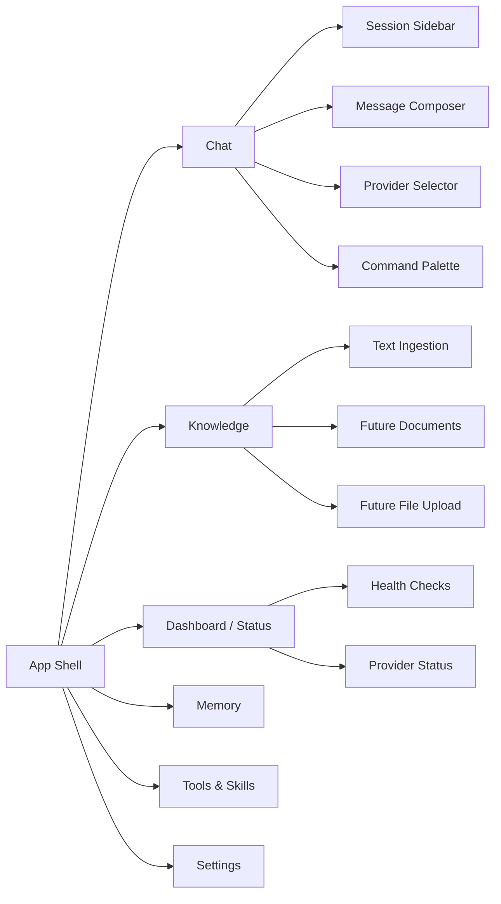
```mermaid
flowchart LR
    AppShell[App Shell]
    AppShell --> Chat[Chat]
    AppShell --> Knowledge[Knowledge]
    AppShell --> Dashboard[Dashboard / Status]
    AppShell --> Memory[Memory]
    AppShell --> Tools[Tools & Skills]
    AppShell --> Settings[Settings]

    Chat --> Sessions[Session Sidebar]
    Chat --> Composer[Message Composer]
    Chat --> Provider[Provider Selector]
    Chat --> CommandPalette[Command Palette]

    Knowledge --> TextIngest[Text Ingestion]
    Knowledge --> FutureDocs[Future Documents]
    Knowledge --> FutureUpload[Future File Upload]

    Dashboard --> Health[Health Checks]
    Dashboard --> Providers[Provider Status]
```

## 3. User-flow conventions

### Flow state labels

- **Current:** Supported by existing backend APIs and frontend-only logic.
- **Partial:** Can be approximated today but needs backend/API improvements for a complete experience.
- **Future:** Requires new APIs, auth, or backend behavior.

### Actors

- **Anonymous local user:** User in development when `API_KEY` is unset.
- **API-key user:** User with a configured static API key.
- **Authenticated user:** Future account-based user.
- **Admin/operator:** User with permissions for status, tool/skill, memory, knowledge, and identity administration.

## 4. First visit and environment setup

### 4.1 First visit with backend available and no API key required

**State:** Current

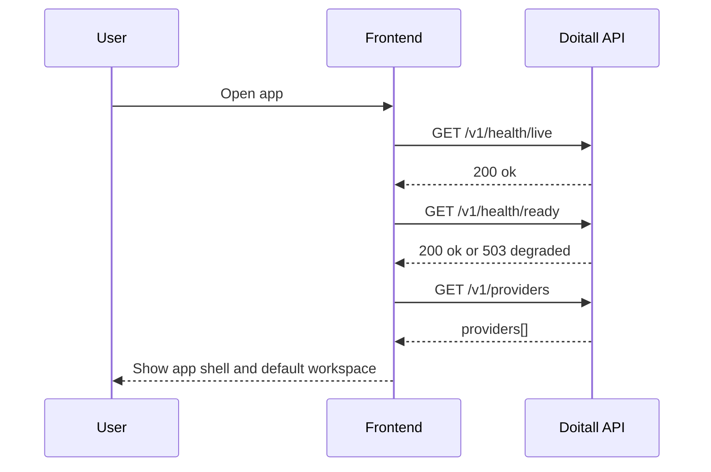
```mermaid
sequenceDiagram
    participant U as User
    participant FE as Frontend
    participant API as Doitall API

    U->>FE: Open app
    FE->>API: GET /v1/health/live
    API-->>FE: 200 ok
    FE->>API: GET /v1/health/ready
    API-->>FE: 200 ok or 503 degraded
    FE->>API: GET /v1/providers
    API-->>FE: providers[]
    FE-->>U: Show app shell and default workspace
```

**Steps**

1. User opens the frontend.
2. Frontend loads stored API base URL or uses default configured base URL.
3. Frontend checks liveness and readiness.
4. Frontend fetches provider status.
5. Frontend shows the Chat workspace if the backend is reachable.
6. If readiness is degraded, the app remains usable where possible and shows a warning banner.

**Empty states**

- No sessions: show welcome prompt examples.
- No providers: show provider configuration guidance and disable chat submission.

**Errors**

- Backend unreachable: show connection setup screen with API base URL field and retry.
- Readiness degraded: show dashboard/status warning and allow limited navigation.

### 4.2 First visit with API key required

**State:** Current for API-key auth; frontend UX required

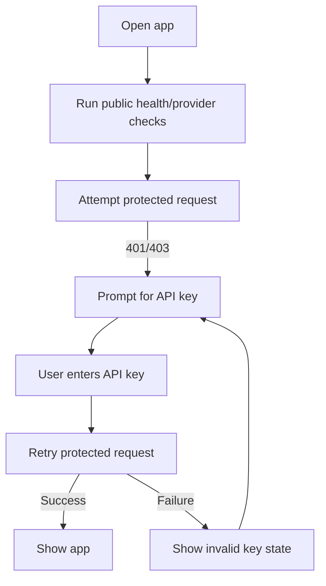
```mermaid
flowchart TD
    Start[Open app] --> PublicChecks[Run public health/provider checks]
    PublicChecks --> ProtectedRequest[Attempt protected request]
    ProtectedRequest -->|401/403| PromptKey[Prompt for API key]
    PromptKey --> EnterKey[User enters API key]
    EnterKey --> Retry[Retry protected request]
    Retry -->|Success| App[Show app]
    Retry -->|Failure| KeyError[Show invalid key state]
    KeyError --> PromptKey
```

**Steps**

1. User opens the app.
2. Public endpoints load successfully.
3. A protected endpoint such as `/v1/sessions` or `/v1/commands` returns unauthorized.
4. Frontend shows an API key setup dialog or settings panel.
5. User enters key.
6. Frontend stores key according to environment policy and retries the request.
7. If valid, the user continues to the app.
8. If invalid, the app keeps the user on the auth setup state and shows remediation copy.

**Requirements**

- Do not hard-code production secrets.
- Provide a clear “clear key” control.
- Explain that browser-stored API keys are intended for local/dev use unless a deployment intentionally accepts that risk.

### 4.3 Backend unavailable setup flow

**State:** Current

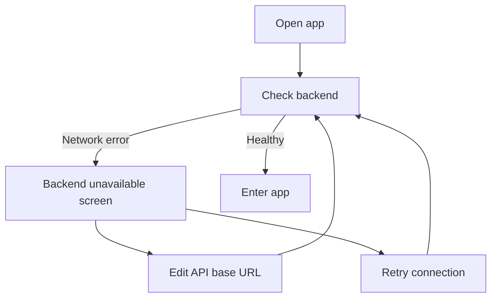
```mermaid
flowchart TD
    Start[Open app] --> Ping[Check backend]
    Ping -->|Network error| Offline[Backend unavailable screen]
    Offline --> EditURL[Edit API base URL]
    Offline --> Retry[Retry connection]
    EditURL --> Ping
    Retry --> Ping
    Ping -->|Healthy| App[Enter app]
```

**User experience**

- Display the current API base URL.
- Explain likely causes: backend not running, wrong port, CORS, network, or reverse proxy issue.
- Provide retry and settings actions.

## 5. Login, sign up, and authentication journeys

The current backend does not provide account login or sign-up APIs. The frontend should support API-key configuration for MVP and be designed to support account auth later.

### 5.1 API key login/setup

**State:** Current

**Primary path**

1. User opens Settings or receives unauthorized response.
2. User chooses “Connect to Doitall API”.
3. User enters API base URL and API key.
4. Frontend validates by calling a protected endpoint.
5. On success, frontend stores key according to environment policy and returns to prior destination.

**Failure path**

1. Protected request returns 401/403.
2. Frontend shows “Invalid or missing API key”.
3. User can retry, edit key, clear key, or change API base URL.

**Design notes**

- API-key setup is not the same as user login.
- Use wording such as “API connection” or “Development access key” unless a real user auth system is added.

### 5.2 Future account login

**State:** Future

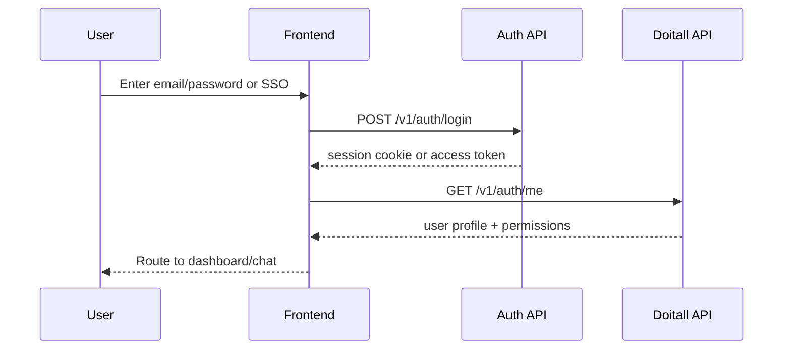
```mermaid
sequenceDiagram
    participant U as User
    participant FE as Frontend
    participant Auth as Auth API
    participant API as Doitall API

    U->>FE: Enter email/password or SSO
    FE->>Auth: POST /v1/auth/login
    Auth-->>FE: session cookie or access token
    FE->>API: GET /v1/auth/me
    API-->>FE: user profile + permissions
    FE-->>U: Route to dashboard/chat
```

**Primary path**

1. User opens login page.
2. User authenticates with email/password, magic link, or SSO.
3. Backend returns secure session cookie or short-lived token.
4. Frontend fetches `/v1/auth/me`.
5. Frontend routes to Chat or Dashboard based on prior route.

**Failure paths**

- Invalid credentials: show inline error.
- MFA required: route to MFA challenge.
- Locked account: show support/admin guidance.
- Expired invite: route to invite recovery.

### 5.3 Future sign-up

**State:** Future

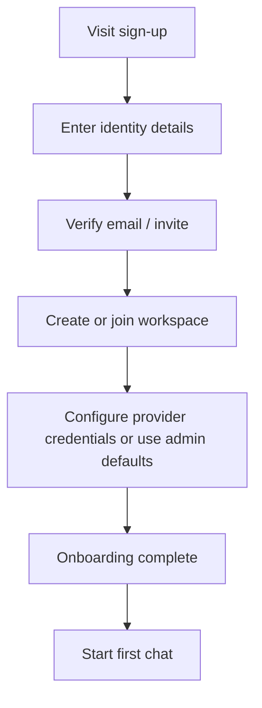
```mermaid
flowchart TD
    Visit[Visit sign-up] --> Enter[Enter identity details]
    Enter --> Verify[Verify email / invite]
    Verify --> Org[Create or join workspace]
    Org --> ProviderSetup[Configure provider credentials or use admin defaults]
    ProviderSetup --> Complete[Onboarding complete]
    Complete --> Chat[Start first chat]
```

**Primary path**

1. User selects Sign up.
2. User enters email/name/password or accepts invite.
3. User verifies email.
4. User creates or joins a workspace.
5. User configures provider credentials if required.
6. User lands on onboarding chat.

**Constraints**

- Requires identity, workspace, invite, email verification, and provider credential APIs.
- Must define whether Doitall is single-user, team, or hosted multi-tenant.

### 5.4 Logout/session expiration

**State:** Future for accounts; current for clearing API key

**Current API-key flow**

1. User opens Settings.
2. User selects Clear API key.
3. Frontend removes local key.
4. Protected requests return unauthorized until a new key is entered.

**Future account flow**

1. User selects Log out.
2. Frontend calls logout/revocation endpoint.
3. Auth cookie/token is cleared.
4. User is routed to login.

## 6. Dashboard and status flows

### 6.1 Operator dashboard overview

**State:** Current/Partial

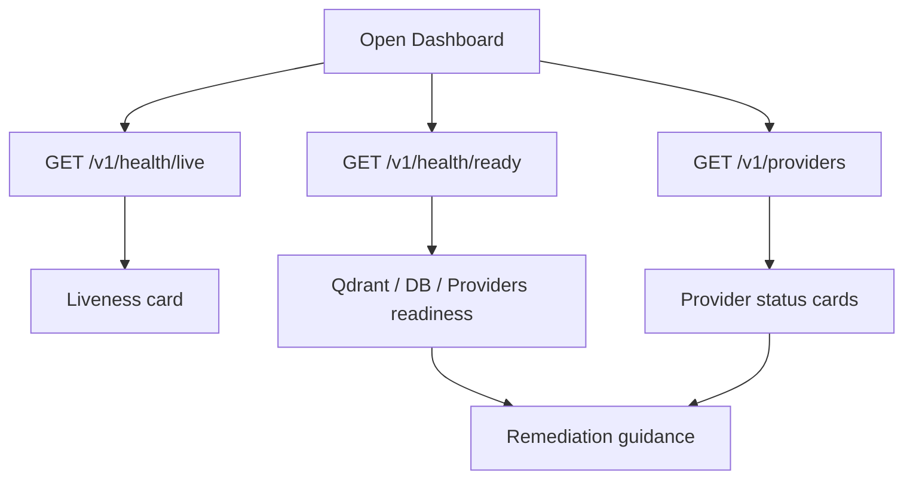
```mermaid
flowchart TD
    Dashboard[Open Dashboard] --> Live[GET /v1/health/live]
    Dashboard --> Ready[GET /v1/health/ready]
    Dashboard --> Providers[GET /v1/providers]
    Live --> LiveCard[Liveness card]
    Ready --> Dependencies[Qdrant / DB / Providers readiness]
    Providers --> ProviderCards[Provider status cards]
    Dependencies --> Guidance[Remediation guidance]
    ProviderCards --> Guidance
```

**Primary path**

1. Admin/operator opens Dashboard.
2. Frontend checks liveness.
3. Frontend checks readiness.
4. Frontend fetches providers.
5. Dashboard renders overall status, dependencies, providers, and warnings.

**Degraded path**

1. Readiness returns 503 with service details.
2. Dashboard marks affected dependency as degraded.
3. UI explains user impact, such as “Knowledge retrieval may be unavailable” or “Sessions may not persist”.

**Empty states**

- No providers registered: show provider configuration steps.
- Metrics unavailable/protected: show that metrics require authorization.

### 6.2 Developer diagnostics flow

**State:** Partial

1. Developer opens Dashboard.
2. Developer copies backend base URL, request ID from errors, and session ID from active chat.
3. Developer opens `/docs` or `/openapi.json` from a link.
4. Developer uses details to reproduce API behavior.

**Future enhancements**

- Show build version, environment, CORS origins, rate-limit settings, and capability flags via `/v1/config/public`.

## 7. Chat flows

### 7.1 New chat happy path with streaming

**State:** Current

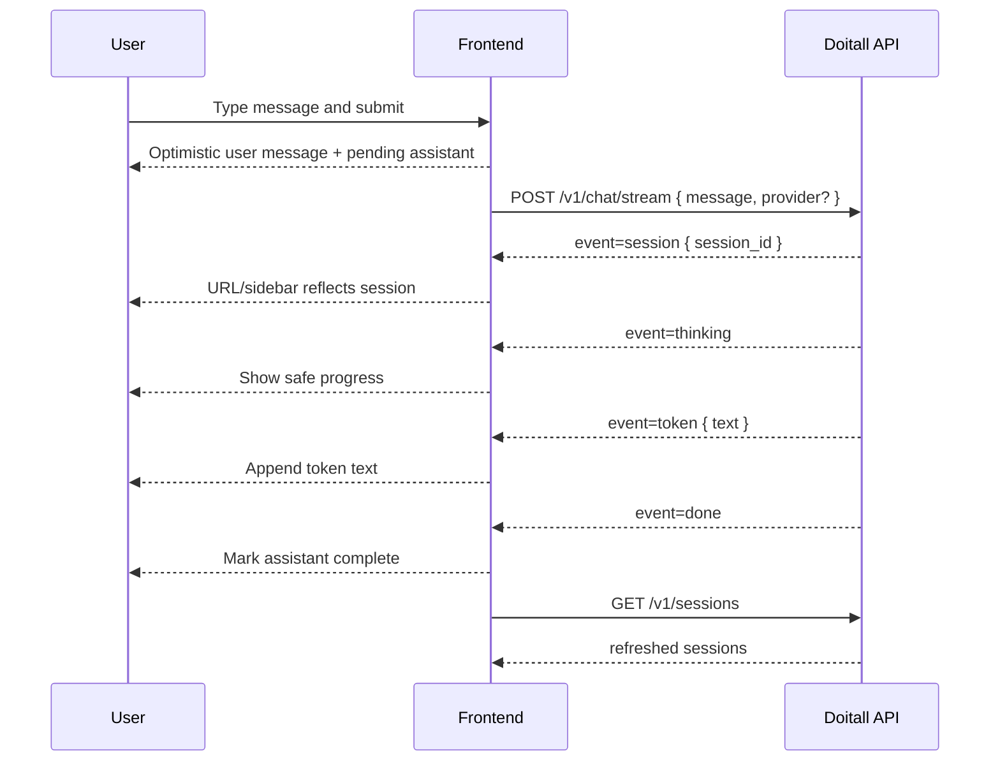
```mermaid
sequenceDiagram
    participant U as User
    participant FE as Frontend
    participant API as Doitall API

    U->>FE: Type message and submit
    FE-->>U: Optimistic user message + pending assistant
    FE->>API: POST /v1/chat/stream { message, provider? }
    API-->>FE: event=session { session_id }
    FE-->>U: URL/sidebar reflects session
    API-->>FE: event=thinking
    FE-->>U: Show safe progress
    API-->>FE: event=token { text }
    FE-->>U: Append token text
    API-->>FE: event=done
    FE-->>U: Mark assistant complete
    FE->>API: GET /v1/sessions
    API-->>FE: refreshed sessions
```

**Steps**

1. User opens Chat with no active session.
2. User optionally selects provider.
3. User types message.
4. User submits.
5. Frontend appends optimistic user message.
6. Frontend creates pending assistant message.
7. Frontend starts POST SSE stream.
8. On `session`, frontend stores session ID and updates route.
9. On `thinking`, frontend shows public progress label.
10. On each `token`, frontend appends text.
11. On `done`, frontend marks message complete.
12. Frontend refreshes session list and, if needed, session detail.

**Acceptance behavior**

- The composer is disabled or guarded while the request is active.
- Draft text is not lost if the request fails before send.
- Hidden chain-of-thought is never shown.

### 7.2 Continue existing session

**State:** Current

1. User selects a session in the sidebar or opens a session URL.
2. Frontend calls `GET /v1/sessions/{session_id}`.
3. Frontend renders prior messages in chronological order.
4. User submits a new message with the same `session_id`.
5. Backend appends to persisted session.
6. Frontend streams response and updates session recency.

**Failure paths**

- Session not found: show not-found page with “Start new chat”.
- Session detail returns very large history: show loading/progressive rendering; future pagination needed.

### 7.3 Non-streaming chat fallback

**State:** Current endpoint, frontend fallback should be implemented

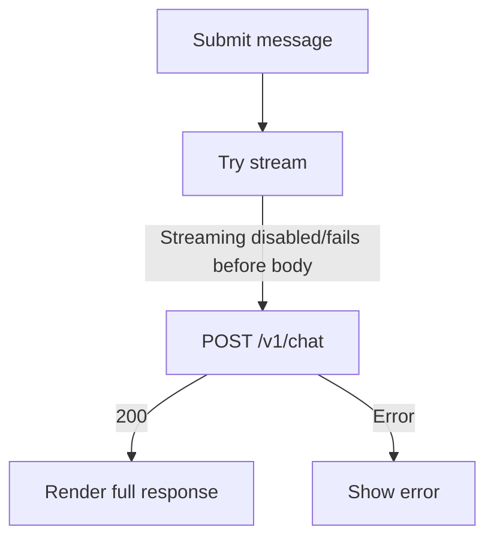
```mermaid
flowchart TD
    Submit[Submit message] --> StreamAttempt[Try stream]
    StreamAttempt -->|Streaming disabled/fails before body| Fallback[POST /v1/chat]
    Fallback -->|200| Render[Render full response]
    Fallback -->|Error| ErrorState[Show error]
```

**Use cases**

- Browser/transport cannot support POST streaming.
- Deployment disables streaming.
- Feature flag routes users to non-streaming transport.

**User experience**

- The UI should still show a pending assistant message.
- Instead of token updates, display a loading indicator until full response returns.

### 7.4 Provider override in chat

**State:** Current

1. User opens provider selector.
2. Frontend displays providers with default and availability labels.
3. User selects provider.
4. Frontend includes `provider` in chat request body.
5. If backend returns unknown provider, frontend shows provider error and suggests selecting another provider.

**Edge cases**

- Provider becomes unavailable after selection.
- Provider list request fails.
- No default provider is available.

### 7.5 Command palette in chat

**State:** Current/Partial

1. User opens command palette by keyboard shortcut or slash input.
2. Frontend calls `GET /v1/commands` if commands are not cached.
3. User filters command list.
4. User selects command.
5. Frontend inserts command into composer or applies its client-side behavior.
6. User submits when ready.

**Empty state**

- No commands returned: show “No commands available”.

### 7.6 Chat retry after recoverable error

**State:** Current frontend responsibility; backend retry endpoint future

1. Stream or chat request fails.
2. Frontend marks pending assistant message as failed.
3. User selects Retry.
4. Frontend resends the last user message.
5. If session ID exists, include it.
6. If retry succeeds, replace failed pending response with completed response or append a new attempt, based on design decision.

**Future improved flow**

- Use `POST /v1/sessions/{session_id}/messages/{message_id}/retry` to regenerate from a precise point.

### 7.7 Delete session flow

**State:** Current

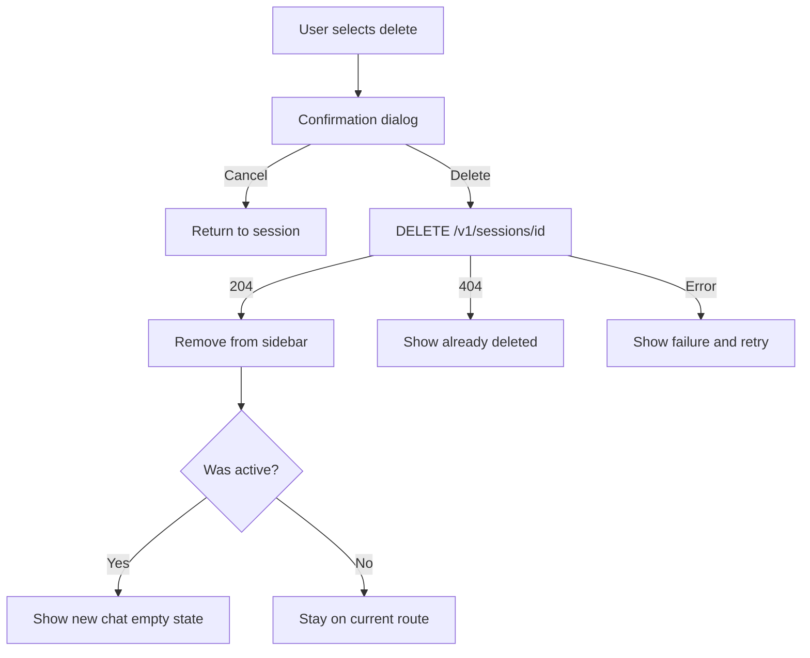
```mermaid
flowchart TD
    Select[User selects delete] --> Confirm[Confirmation dialog]
    Confirm -->|Cancel| Return[Return to session]
    Confirm -->|Delete| DeleteAPI[DELETE /v1/sessions/id]
    DeleteAPI -->|204| Remove[Remove from sidebar]
    Remove --> IsActive{Was active?}
    IsActive -->|Yes| Empty[Show new chat empty state]
    IsActive -->|No| Stay[Stay on current route]
    DeleteAPI -->|404| NotFound[Show already deleted]
    DeleteAPI -->|Error| Error[Show failure and retry]
```

**Requirements**

- Confirm destructive action.
- If active session is deleted, clear active chat state.
- Refresh session list after deletion.

## 8. Tool execution flows

The backend supports tool calling internally through the agent executor and skill/tool engine. The current stream does not emit structured tool events. Frontend tool execution visibility is therefore partial today.

### 8.1 Invisible tool execution during chat

**State:** Current

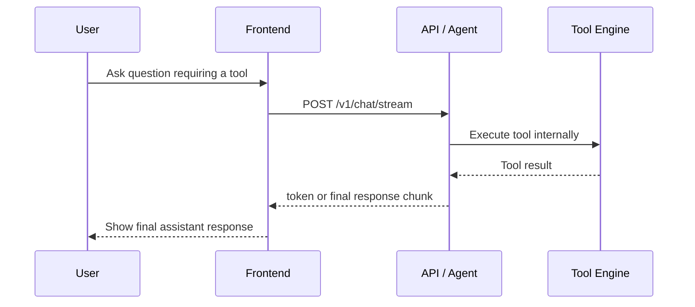
```mermaid
sequenceDiagram
    participant U as User
    participant FE as Frontend
    participant API as API / Agent
    participant Tool as Tool Engine

    U->>FE: Ask question requiring a tool
    FE->>API: POST /v1/chat/stream
    API->>Tool: Execute tool internally
    Tool-->>API: Tool result
    API-->>FE: token or final response chunk
    FE-->>U: Show final assistant response
```

**User experience**

- User asks a question such as a calculation.
- Backend may invoke `calculator` internally.
- Frontend only displays safe progress and final answer unless session detail later includes tool messages.

**Limitations**

- No live `tool_call` or `tool_result` stream events.
- Tool execution may cause streaming to appear as a single final chunk.

### 8.2 Future visible tool timeline

**State:** Future

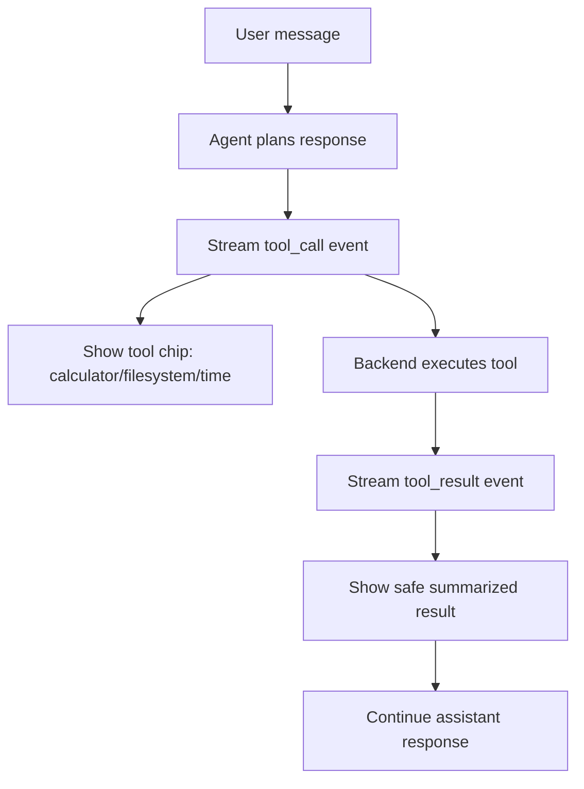
```mermaid
flowchart TD
    Message[User message] --> Agent[Agent plans response]
    Agent --> ToolCall[Stream tool_call event]
    ToolCall --> UserNotice[Show tool chip: calculator/filesystem/time]
    ToolCall --> Execute[Backend executes tool]
    Execute --> ToolResult[Stream tool_result event]
    ToolResult --> SafeSummary[Show safe summarized result]
    SafeSummary --> Final[Continue assistant response]
```

**Requirements**

- Backend emits safe `tool_call` and `tool_result` events.
- Frontend displays tool name, status, duration, and safe result summary.
- Sensitive details are redacted or not sent.
- Failed tool calls show recoverable explanation where possible.

### 8.3 Tool failure flow

**State:** Partial/Future

1. User submits request requiring a tool.
2. Backend tool call fails due to validation, permission, unknown tool, or runtime error.
3. Current behavior: assistant may summarize failure or stream returns generic error.
4. Future behavior: frontend receives structured failed tool event.
5. UI shows “Tool failed” with safe reason and lets user continue/retry.

## 9. Skill execution and skill management flows

### 9.1 Built-in skill use through chat

**State:** Current

Built-in skills such as calculator, filesystem, and time are available to the agent. Users do not directly invoke skill APIs; they invoke them through natural language or commands in chat.

**Examples**

- “What is 42 * 19?” may use calculator.
- “What time is it in UTC?” may use time.
- “List files in the workspace” may use filesystem if permitted.

**Flow**

1. User asks for an action.
2. Agent decides whether to call a skill/tool.
3. Backend executes through skill manager/tool executor.
4. Assistant responds with result.
5. Conversation persists messages/tool results.

### 9.2 Future skill catalog

**State:** Future

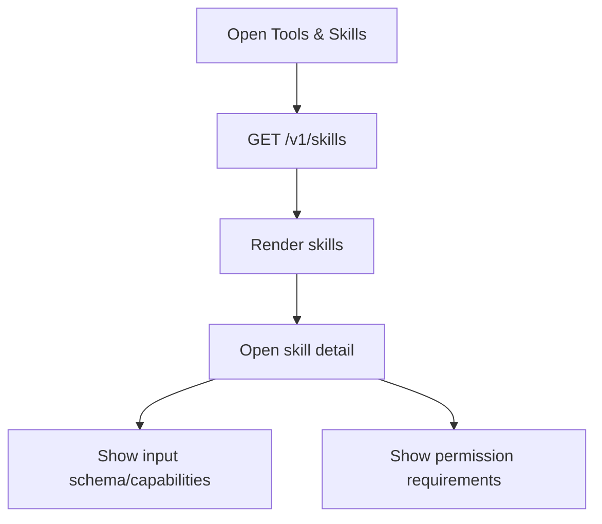
```mermaid
flowchart TD
    Open[Open Tools & Skills] --> Fetch[GET /v1/skills]
    Fetch --> List[Render skills]
    List --> Detail[Open skill detail]
    Detail --> Schema[Show input schema/capabilities]
    Detail --> Permission[Show permission requirements]
```

**Requirements**

- List enabled/disabled skills.
- Show skill descriptions, versions, input schemas, permissions, and availability.
- Explain filesystem write/delete policy.

### 9.3 Future admin enable/disable skill

**State:** Future

1. Admin opens skill detail.
2. Admin toggles enabled/disabled.
3. Frontend confirms impact.
4. Frontend calls admin skill endpoint.
5. UI updates registry state.
6. Active chats use updated skill availability.

**Security requirement**

- Only authorized admins may modify skill settings.

## 10. Identity management flows

Identity management is future functionality. Current frontend should not imply true multi-user identity exists if only API-key setup is available.

### 10.1 Future profile management

**State:** Future

1. Authenticated user opens Settings → Profile.
2. Frontend fetches `/v1/auth/me` or profile endpoint.
3. User edits display name, avatar, timezone, or preferences.
4. Frontend validates input.
5. Frontend saves profile.
6. UI confirms update.

### 10.2 Future password/MFA management

**State:** Future

1. User opens Settings → Security.
2. User changes password or configures MFA.
3. Backend requires reauthentication for sensitive action.
4. User completes challenge.
5. Security setting is updated.

### 10.3 Future workspace/team management

**State:** Future

1. Admin opens Settings → Workspace.
2. Admin invites users, changes roles, or removes users.
3. Frontend enforces role-based UI visibility.
4. Backend enforces authorization.

## 11. Memory management flows

Memory management is a future/admin-sensitive surface because current APIs do not expose memory list/search/edit/delete and memory namespacing/authorization must be resolved first.

### 11.1 Future memory list

**State:** Future

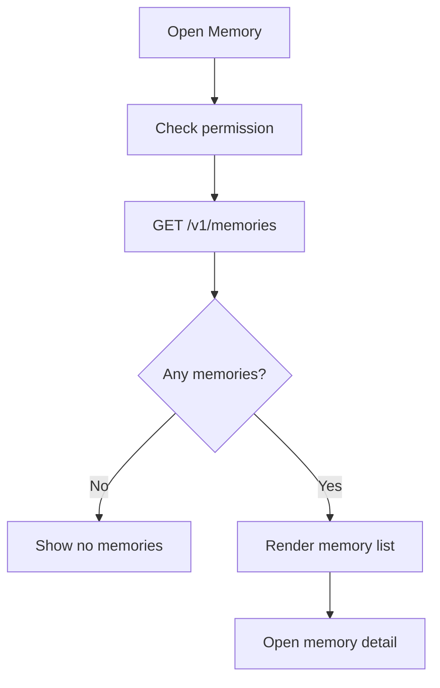
```mermaid
flowchart TD
    Open[Open Memory] --> Auth[Check permission]
    Auth --> Fetch[GET /v1/memories]
    Fetch --> Empty{Any memories?}
    Empty -->|No| EmptyState[Show no memories]
    Empty -->|Yes| List[Render memory list]
    List --> Detail[Open memory detail]
```

**User experience**

- Show memory content, score/confidence if available, creation/update timestamps, source, and scope.
- Provide filters by session, agent, user, or namespace once supported.

### 11.2 Future semantic memory search

**State:** Future

1. User opens Memory.
2. User enters search query.
3. Frontend calls `POST /v1/memories/search`.
4. Results show matched memories and relevance metadata.
5. User can open, edit, or delete memory if authorized.

### 11.3 Future memory edit/delete

**State:** Future

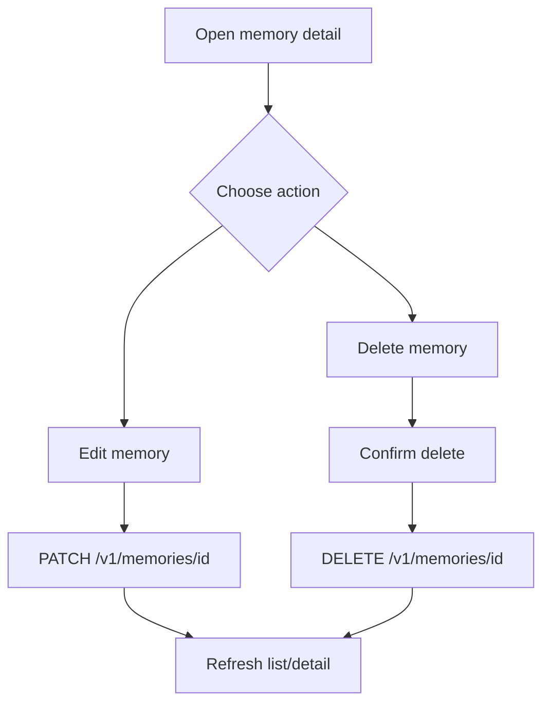
```mermaid
flowchart TD
    Detail[Open memory detail] --> Action{Choose action}
    Action --> Edit[Edit memory]
    Action --> Delete[Delete memory]
    Edit --> Save[PATCH /v1/memories/id]
    Delete --> Confirm[Confirm delete]
    Confirm --> DeleteAPI[DELETE /v1/memories/id]
    Save --> Refresh[Refresh list/detail]
    DeleteAPI --> Refresh
```

**Security concerns**

- Memory may contain sensitive user details.
- Deletion semantics must be clear: deleting a memory is not the same as deleting session messages.

## 12. Knowledge and file upload flows

### 12.1 Text knowledge ingestion

**State:** Current

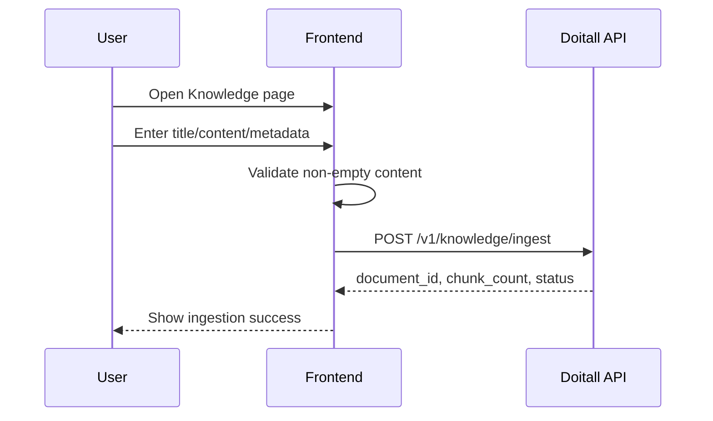
```mermaid
sequenceDiagram
    participant U as User
    participant FE as Frontend
    participant API as Doitall API

    U->>FE: Open Knowledge page
    U->>FE: Enter title/content/metadata
    FE->>FE: Validate non-empty content
    FE->>API: POST /v1/knowledge/ingest
    API-->>FE: document_id, chunk_count, status
    FE-->>U: Show ingestion success
```

**Steps**

1. User opens Knowledge.
2. User enters optional title.
3. User enters required content.
4. User optionally adds metadata.
5. Frontend validates content and metadata shape.
6. Frontend submits to backend.
7. UI shows document ID, chunk count, and status.
8. UI explains that future chat turns may retrieve relevant chunks.

**Error states**

- Empty content: client-side validation error.
- Content too long: backend validation error.
- Too many metadata keys: backend/client validation error.
- Qdrant/provider/embedding failure: ingestion failed message.

### 12.2 Future file upload ingestion

**State:** Future

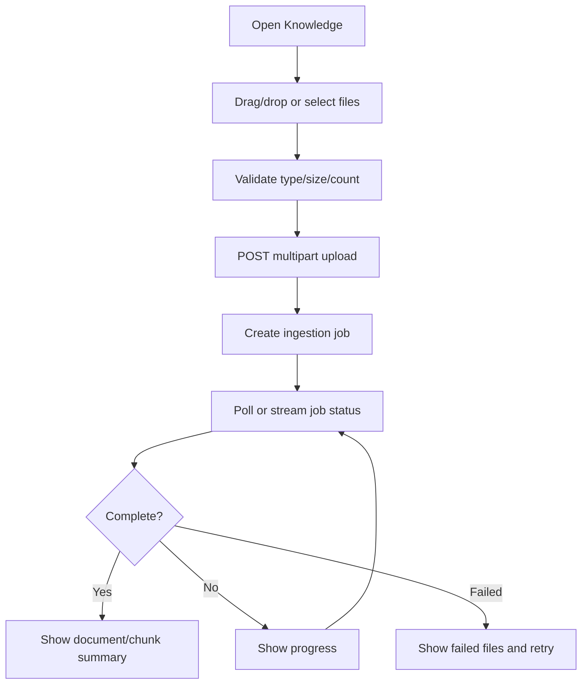
```mermaid
flowchart TD
    Open[Open Knowledge] --> Drop[Drag/drop or select files]
    Drop --> Validate[Validate type/size/count]
    Validate --> Upload[POST multipart upload]
    Upload --> Job[Create ingestion job]
    Job --> Poll[Poll or stream job status]
    Poll --> Complete{Complete?}
    Complete -->|Yes| Success[Show document/chunk summary]
    Complete -->|No| Progress[Show progress]
    Progress --> Poll
    Complete -->|Failed| Failure[Show failed files and retry]
```

**Requirements**

- Supported file types should align with backend loaders.
- Large uploads should use ingestion jobs rather than blocking requests.
- UI should support partial success for multi-file ingestion.

### 12.3 Future knowledge document management

**State:** Future

1. User opens Knowledge documents.
2. Frontend fetches document list.
3. User filters/searches documents.
4. User opens document detail and chunk list.
5. User deletes or re-ingests document if authorized.
6. Frontend refreshes list and shows result.

### 12.4 Future knowledge search preview

**State:** Future

1. User enters query in Knowledge search.
2. Frontend calls `POST /v1/knowledge/search`.
3. UI displays matching chunks and metadata.
4. User can inspect retrieval relevance before testing in chat.

## 13. Search flows

### 13.1 Current session navigation without search

**State:** Current

1. User opens Chat.
2. Sidebar loads all sessions.
3. User scans sessions by recency and message count.
4. User selects a session.

**Limitations**

- No backend search, pagination, title, or archive support.

### 13.2 Future session search

**State:** Future

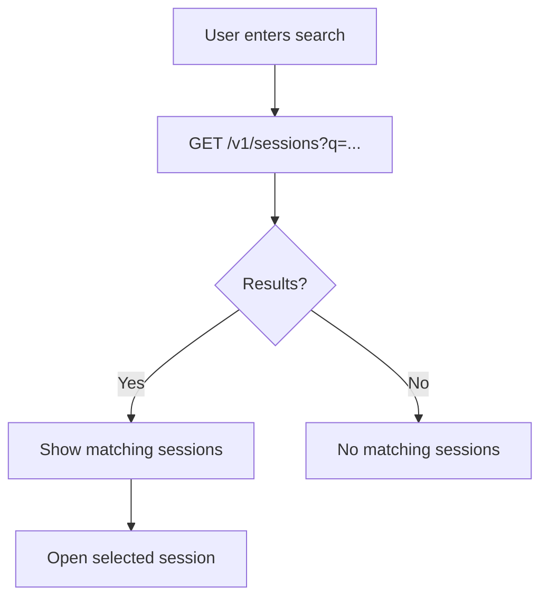
```mermaid
flowchart TD
    Input[User enters search] --> Query[GET /v1/sessions?q=...]
    Query --> Results{Results?}
    Results -->|Yes| List[Show matching sessions]
    Results -->|No| Empty[No matching sessions]
    List --> Open[Open selected session]
```

### 13.3 Future global search

**State:** Future

Search should eventually span:

- Sessions and messages.
- Knowledge documents/chunks.
- Memories.
- Tools/skills/commands.

**Flow**

1. User opens global search.
2. User types query.
3. Frontend calls search APIs or federates requests.
4. Results are grouped by type.
5. User selects a result and navigates to its detail page.

## 14. Settings flows

### 14.1 API connection settings

**State:** Current frontend-only

1. User opens Settings → API connection.
2. User views current API base URL.
3. User edits API base URL.
4. Frontend validates URL format.
5. Frontend checks liveness/readiness.
6. User saves if reachable or confirms save despite warning.

### 14.2 API key settings

**State:** Current frontend-only with backend protected endpoints

1. User opens Settings → API key.
2. User enters, replaces, or clears API key.
3. Frontend validates against protected endpoint.
4. On success, protected features unlock.
5. On failure, protected features remain locked.

### 14.3 Provider preference settings

**State:** Current frontend-only

1. User opens Settings or provider selector.
2. User selects preferred provider.
3. Frontend stores preference locally.
4. New chat requests include provider unless user clears preference.

### 14.4 Future theme and accessibility settings

**State:** Future/frontend-only

1. User selects light/dark/system theme.
2. User configures reduced motion or compact message density.
3. Frontend persists preference locally or to profile when identity exists.

### 14.5 Future admin settings

**State:** Future

- CORS/config warnings.
- Rate-limit visibility.
- Provider credentials status.
- Skill permissions.
- Retention policies.
- Audit log configuration.

## 15. Error handling flows

### 15.1 Authentication failure

**State:** Current

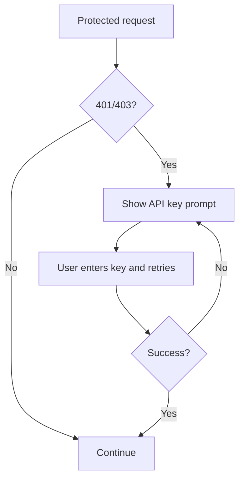
```mermaid
flowchart TD
    Request[Protected request] --> AuthFail{401/403?}
    AuthFail -->|No| Continue[Continue]
    AuthFail -->|Yes| Prompt[Show API key prompt]
    Prompt --> Retry[User enters key and retries]
    Retry --> Success{Success?}
    Success -->|Yes| Continue
    Success -->|No| Prompt
```

**User-facing message**

- “This Doitall API requires an access key. Enter a valid key to continue.”

### 15.2 Rate limit failure

**State:** Current

1. User submits too many chat or ingestion requests.
2. Backend returns 429.
3. Frontend shows rate-limit message.
4. Composer/form remains disabled briefly or shows retry-after behavior if available.
5. User retries after waiting.

**Future improvement**

- Backend returns `Retry-After`; frontend displays countdown.

### 15.3 Provider unavailable or unknown provider

**State:** Current

1. User selects unavailable/unknown provider or default provider fails.
2. Backend returns error or provider endpoint marks unavailable.
3. Frontend shows provider-specific guidance.
4. User selects another provider or checks configuration.

### 15.4 Stream failure

**State:** Current

1. Frontend begins stream.
2. Network, backend, or provider failure occurs.
3. Frontend receives `error` event or stream closes unexpectedly.
4. Pending assistant message becomes failed.
5. User can retry or switch provider.

### 15.5 Validation failure

**State:** Current

Examples:

- Empty chat message.
- Chat message exceeds max length.
- Knowledge content is empty.
- Knowledge metadata has too many keys.

**Flow**

1. User submits invalid input.
2. Frontend blocks known invalid input before API call.
3. If backend returns validation error, frontend maps detail into field-level or form-level error.

### 15.6 Backend degraded/unavailable

**State:** Current

1. Health check fails or readiness returns degraded.
2. Frontend shows global degraded banner.
3. Affected actions display contextual warnings.
4. User can retry health check or adjust API URL.

### 15.7 Not found

**State:** Current for sessions

1. User opens deleted/invalid session URL.
2. Backend returns 404.
3. Frontend shows “Session not found”.
4. User can return to session list or start new chat.

### 15.8 Destructive action failure

**State:** Current for session delete

1. User confirms delete.
2. Backend fails or returns 404.
3. If 404, frontend treats as already deleted and refreshes list.
4. If other failure, frontend keeps session visible and shows retry.

## 16. Empty state flows

### 16.1 No sessions

**State:** Current

- Show welcome state, product explanation, and prompt suggestions.
- Primary CTA: “Start a chat”.
- Secondary CTAs: configure provider, ingest knowledge, view status.

### 16.2 Empty active chat

**State:** Current

- Show composer-focused onboarding.
- Suggest example prompts:
  - “Summarize what Doitall can do.”
  - “What is 12 * 9?”
  - “What providers are available?”

### 16.3 No providers

**State:** Current

- Disable chat submission.
- Explain that provider credentials or default provider configuration may be missing.
- Link to Dashboard/Status and setup docs.

### 16.4 No commands

**State:** Current

- Command palette shows “No commands available”.
- Chat remains usable.

### 16.5 No knowledge documents

**State:** Current/Future

- Current: show text ingestion form and explain no document list is available yet.
- Future: document list empty state with upload/ingest CTA.

### 16.6 No memories

**State:** Future

- Explain what memory is and how it is created.
- Provide privacy/security explanation.
- Do not show memory UI unless backend supports authorized access.

### 16.7 No search results

**State:** Future

- Show query-specific empty result state.
- Offer alternate scopes or clear filters.

## 17. Frontend state machine for chat submission

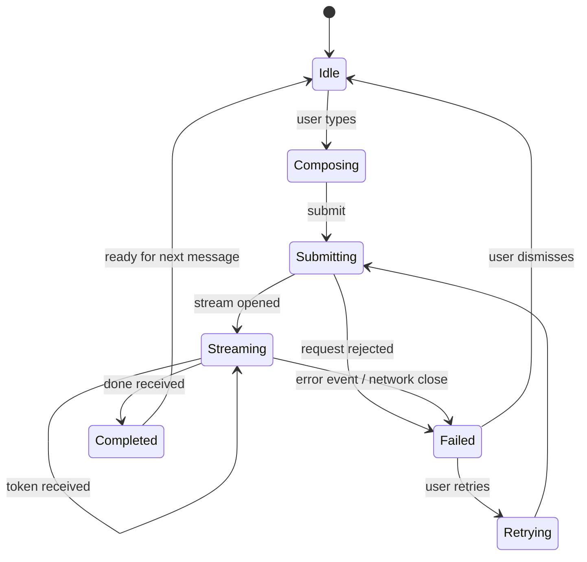
```mermaid
stateDiagram-v2
    [*] --> Idle
    Idle --> Composing: user types
    Composing --> Submitting: submit
    Submitting --> Streaming: stream opened
    Submitting --> Failed: request rejected
    Streaming --> Streaming: token received
    Streaming --> Completed: done received
    Streaming --> Failed: error event / network close
    Completed --> Idle: ready for next message
    Failed --> Retrying: user retries
    Failed --> Idle: user dismisses
    Retrying --> Submitting
```

### State descriptions

- **Idle:** No active draft or request.
- **Composing:** User is editing draft.
- **Submitting:** Request is in flight before stream tokens arrive.
- **Streaming:** Assistant response is being appended.
- **Completed:** Response finished successfully.
- **Failed:** Request or stream failed.
- **Retrying:** User chose to resend the last message.

## 18. Cross-cutting permission and capability flow

```mermaid
flowchart TD
    Load[App load] --> Public[Fetch public status/providers]
    Public --> Protected[Try protected capabilities]
    Protected --> Auth{Authorized?}
    Auth -->|No| Limited[Limited mode + auth prompt]
    Auth -->|Yes| Capabilities[Resolve capabilities]
    Capabilities --> Render[Render allowed navigation/actions]
    Limited --> RenderLimited[Hide/disable protected actions]
```

### Requirements

- Frontend must not assume admin capability from client state alone.
- Backend must enforce authorization for all protected/future admin actions.
- Frontend should hide or disable actions when permissions are unavailable, while still handling backend denial gracefully.

## 19. QA scenario matrix

| Scenario | Expected result |
| --- | --- |
| Open app with backend down | Connection setup/error screen with retry. |
| Open app with backend ready | Chat workspace loads. |
| Open app with readiness degraded | App loads with degraded banner/status details. |
| Submit first chat message | Session event received; streamed response renders; session list refreshes. |
| Submit empty chat message | Client validation prevents request. |
| Stream returns error | Pending assistant marked failed; retry available. |
| Unknown provider selected | Provider error shown; user can choose another provider. |
| No providers available | Composer disabled with setup guidance. |
| Delete active session | Confirmation, API delete, active chat cleared. |
| Open missing session URL | Not-found state with start-new-chat action. |
| Ingest valid text knowledge | Success card with document ID/chunk count/status. |
| Ingest empty knowledge | Client validation error. |
| Protected endpoint without key | API key prompt. |
| Invalid API key | Auth failure persists with retry/edit key. |
| Rate limit exceeded | Rate-limit error with wait/retry guidance. |
| Command palette no results | Empty palette state. |
| Reduced motion enabled | Animations minimized. |
| Screen reader active during streaming | Controlled announcements, no token spam. |

## 20. Implementation dependency summary

### Flows possible with current backend

- API-key setup against protected endpoints.
- Dashboard/status using health and providers.
- New chat and existing-session chat.
- Streaming with `session`, `thinking`, `token`, `done`, and `error` events.
- Session list/detail/delete.
- Provider selection.
- Command palette metadata.
- Text knowledge ingestion.
- Core empty/error states.

### Flows requiring backend additions

- Real login, sign-up, logout, user profile, MFA, roles, and teams.
- Session rename, pin, archive, search, pagination, message edit, feedback, retry.
- Structured live tool-call/tool-result events.
- Tool and skill registry/admin endpoints.
- Knowledge document list/detail/search/delete and file upload.
- Memory list/search/edit/delete and namespacing.
- Run IDs, cancellation, resumable streams, final usage/model metadata.
- Public config/capability endpoint.
- Global search.

## 21. Design deliverables implied by these flows

Design should provide:

1. App shell layout.
2. Chat empty state.
3. Chat loading, streaming, completed, failed, and retry states.
4. Session sidebar states: loading, empty, populated, active, delete-confirming, error.
5. Provider selector states: loading, available, unavailable, default, empty, error.
6. API key setup modal/settings page.
7. Backend unavailable screen.
8. Dashboard/status cards and degraded-state banner.
9. Knowledge ingestion form and success/error states.
10. Command palette.
11. Future tool timeline pattern.
12. Future memory and knowledge management list/detail patterns.
13. Accessibility annotations for focus, keyboard shortcuts, live regions, and reduced motion.

## 22. Engineering deliverables implied by these flows

Frontend engineering should plan for:

1. Central API client with API base URL and credential handling.
2. POST-compatible SSE parser.
3. Chat state machine or equivalent reducer.
4. Session data-fetching hooks.
5. Provider and health data-fetching hooks.
6. Knowledge ingestion mutation hook.
7. Command palette data-fetching hook.
8. Error normalization layer.
9. Empty-state components.
10. Permission/capability abstraction ready for future backend APIs.
11. OpenAPI-generated TypeScript types once frontend scaffolding exists.
12. Tests for SSE parsing, auth failure handling, stream failures, session deletion, and ingestion validation.
